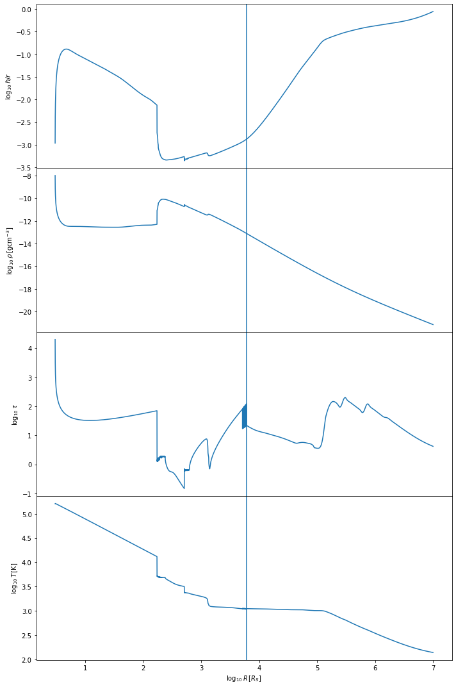
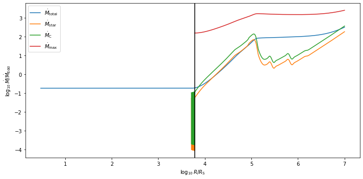
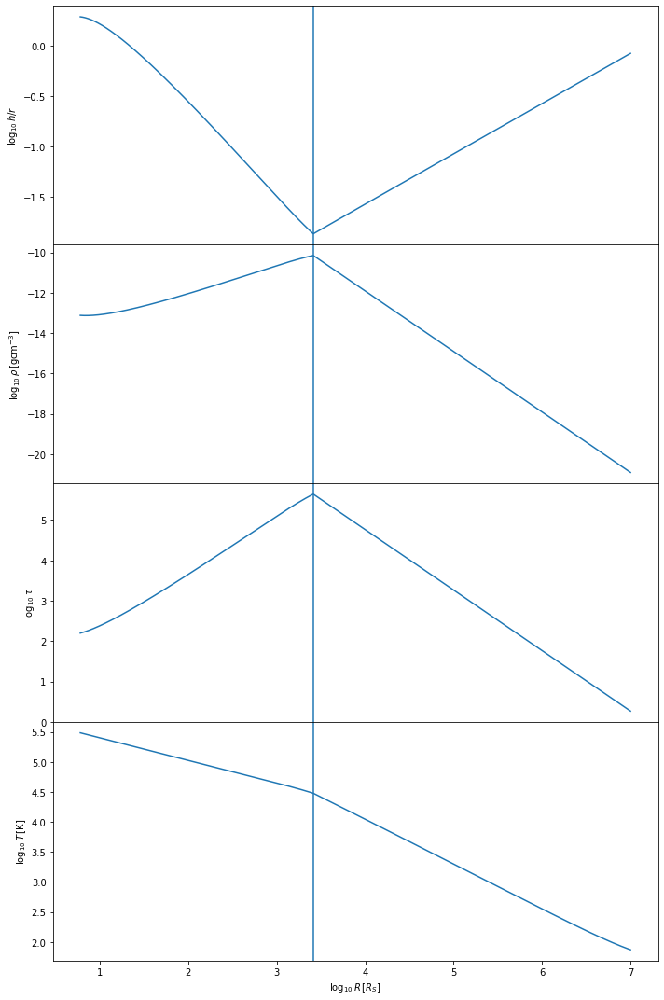
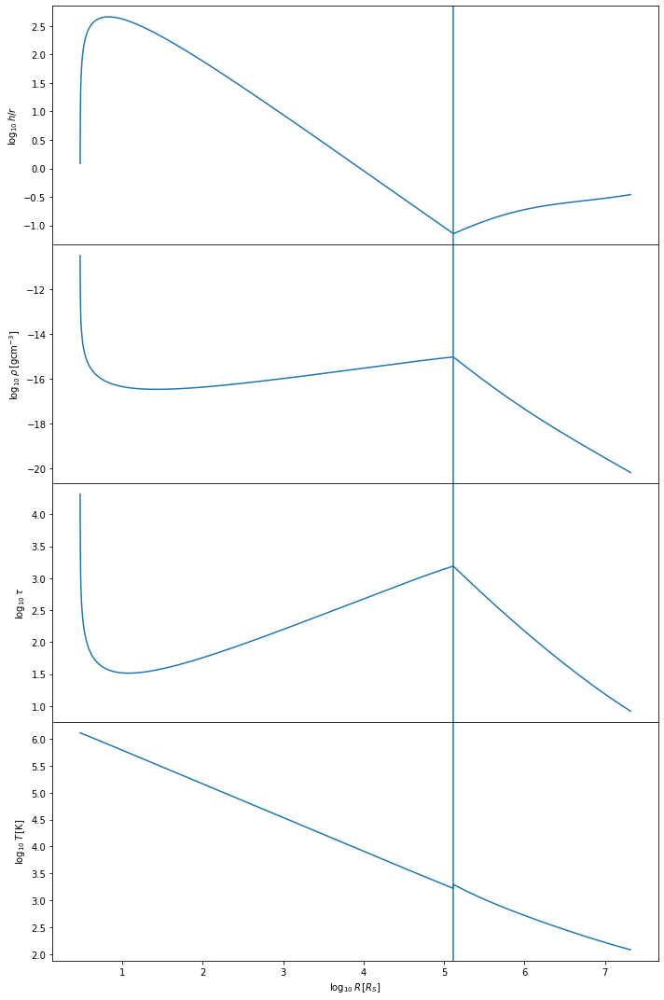
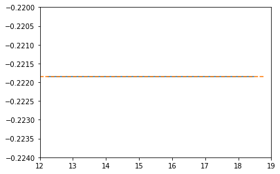
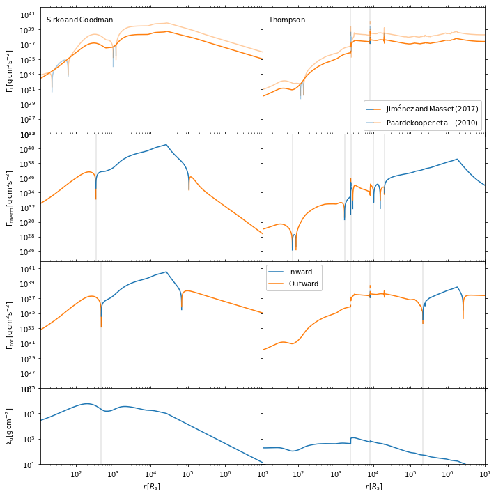

Examples for pagn
=================

These are some of the examples for the pagn package; which uses the
equations from `Sirko and Goodman
2003 <https://academic.oup.com/mnras/article/341/2/501/1105444>`__ and
`Thompson et
al. 2005 <https://iopscience.iop.org/article/10.1086/431923>`__ to
evolve parametric Active Galactic Nuclei disks (AGNs).

Getting Started
---------------

First, import the models from the package:

.. code:: ipython3

    from pagn import Thompson
    from pagn import Sirko
    import numpy as np
    import matplotlib.pyplot as plt
    import pagn.constants as ct

To quickly test pagn, try printing the default disk parameters:

.. code:: ipython3

    s = Sirko.SirkoAGN()
    t = Thompson.ThompsonAGN()

.. parsed-literal::

    ### Sirko & Goodman 2003 parameters ###
    Mbh = 1.000000e+08 MSun
    Mdot = 1.298344e+00 MSun/yr
    le = 0.5
    Rs = 9.570121e-06 pc
    Rmin = 2.500000e+00 Rs
    Rmax = 1.000000e+07 Rs, 9.570121e+01 pc
    alpha = 0.01
    b = 0
    eps = 0.1
    X = 0.7
    Opacity = combined
    
    debug = False
    xtol = 1e-10
    root method = lm
    sigma from M using M-sigma relation
    ### Thompson et al. 2005 parameters ###
    Mbh = 1.000000e+08 MSun
    Mdot_out = 3.200000e+02 MSun/yr
    Rs = 9.570121e-06 pc
    Rin = 3.000000e+00 Rs
    Rout = 2.089838e+07 Rs = 2.000000e+02 pc
    sigma = 1.879994e+02 km/s
    epsilon =  0.001
    m =  0.2
    xi =  1.0
    Opacity = combined
    
    debug = False
    xtol = 1e-10
    root method = lm

The output should look the same as the one above. Once this small check
has been done, we can move on to evolving our disks.

Evolving AGN disks
------------------

Define input parameters for the AGN disk.

.. code:: ipython3

    #Sirko & Goodman 2003
    Mbh=1e8*ct.MSun #10^8 solar mass SMBH
    le=0.5 #Eddington ratio
    Mdot= None #let the accretion rate be calculated through lE
    alpha=0.01 #standard Shakura Sunyaev parameter value
    X=0.7 #Hydrogen abundance is 0.7 for this disk
    b=0 #Let's see the alpha-disk case
    Opacity="combined" #most up to date opacity values

.. code:: ipython3

    #Thompson et al. 2005
    sigma = 300e3 #stellar dispersion relation
    mbh = (2e8*ct.MSun) * ((sigma / 200e3) ** 4) #let's use our own M-sigma relation to find mass
    epsilon=1e-3 #Star formation radiative efficiency
    m= 0.2 #Value for angular momentum efficiency as suggested by Thompson et al. 2005
    xi= 1. #Approximate supernovae radiative fraction as suggested by Thompson et al. 2005
    Mdot_out=None #For mbh in 10^8-10^9 Msun range, the outer accretion rate scaling should be sufficient for bright AGN formation
    Rout=None #Let's use 1e7 Schwarzchild radii for outer boundary
    Rin=None #Rin is 3 Schwarzchild radii 
    opacity="combined" #most up to date opacity values

We now solve the disk equations. Note that when calling the SirkoAGN and
ThompsonAGN models, there is a printout of the input parameters. This
can be used to check that the units have been correctly converted and
what the outputs of the scalings are.

.. code:: ipython3

    %%capture
    sk = Sirko.SirkoAGN(Mbh=Mbh, le=le, Mdot=Mdot, alpha=alpha, X=X, 
                        b=b, opacity = Opacity)
    sk.solve_disk(N=1e4) ; #10^4 tends to be a sufficient resolution for most Mbh values

.. code:: ipython3

    %%capture
    tho = Thompson.ThompsonAGN(Mbh = mbh, sigma = sigma, epsilon = epsilon, m = m, xi = xi,
                          Mdot_out= Mdot_out, Rout = Rout, Rin = Rin, opacity =opacity)
    tho.solve_disk(N=1e4) ;

To quickly check that the Sirko & Goodman model ran correctly, we can
plot some key parameters

.. code:: ipython3

    sk.plot()

.. image:: output_16_0.png

The Sirko & Goodman model tends to be simpler than the Thompson et al
model. We expect the temperature of the disk to decrease with distance
from the central BH, starting at values of :math:`10^5-10^6` Kelvin,
depending on the mass of the central BH. The h/r ratio should stay below
one, at least in the inner regions of the disk. The vertical line shows
where we have switched from the inner regime to the outer regime.

We can similarly check the Thompson et al model ran correctly.

.. code:: ipython3

    tho.plot()

The Thompson et al. model tends to be more complicated than the Sirko &
Goodman model. We expect the temperature of the disk to decrease with
distance from the central BH, starting at values of :math:`10^5` Kelvin
and dropping to lower temperature values than for the Sirko & Goodman
case, depending on the mass of the central BH. The optical depth
:math:`\tau` should look more complex than in the Sirko & Goodman case.
The h/r ratio should stay below one, at least in the inner regions of
the disk. The vertical line shows where we have switched from the inner
regime to the outer regime.

A significant difference between the Thompson et al. model and the Sirko
and Goodman model is that the Thompson et al. model has a varying
accretion rate :math:`\dot{M}`. To check that enough gas is being
accreted onto the central BH, one can also plot the accretion rate in
the Thompson et al. disk:

.. code:: ipython3

    tho.plot_mdot()

.. parsed-literal::

     ### Checking Accretion Rates ###
    Mdot_Edd = 2.629148e+01 Msun per year
    Mdot_c (r = Rout) = 9.606143e+03 Msun per year 
    Mdot_out = 8.311237e+03 Msun per year
    Mdot (r = Rin) = 4.815066e+00 Msun per year = 1.831417e-01 Mdot_Edd

We see that in this case, :math:`\dot{M}_{\rm out}` is below the
critical accretion rate :math:`\dot{M}_{\rm c}` at the outer boundary.
However, the accretion rate at the central BH is
:math:`\approx 5 \, M_{\odot}/{\rm yr}`, which is deemed enough to fuel
a bright AGN.

One may also wish to save their results in a txt file.

.. code:: ipython3

    def save(obj, filename):
        """Method to save key AGN model parameters to filename
        
        Parameters
        ----------
        obj: object
            Python object representing a solved AGN disk either from the Sirko & Goodman model
            or from the Thompson model
        
        """
        pgas = sk.rho * sk.T * ct.Kb / ct.massU
        prad = 4 * ct.sigmaSB * (sk.T ** 4) / (3 * ct.c)
        cs = np.sqrt((pgas + prad) / (sk.rho))
        omega = obj.Omega
        rho = obj.rho
        h = obj.h
        T = obj.T
        tauV = obj.tauV
        Q = obj.Q
        R = obj.R
        if hasattr(obj, "eta"):
            np.savetxt(filename, np.vstack((R/ct.pc, Omega, T, rho, h, obj.eta, cs, tauV, Q)).T)
        else:
            np.savetxt(filename, np.vstack((R/ct.pc, Omega, T, rho, h, cs, tauV, Q)).T)

Custom Opacity
--------------

Both SirkoAGN and ThompsonAGN can take in a custom opacity. The opacity
values have to be provided in a specific format for this to work. Below,
we generate some fake opacity values and show how to input them into the
models.

.. code:: ipython3

    #First, generate or provide the temperature and density arrays over which the opacity grid
    #is constructed. These must be in SI units. They should also ideally cover values of 
    #rho in the range [10^-15 g/m^3, 10^-4 g/m^3] and temperature in the range [10 K, 10^6 K].
    rho_arr = np.logspace(-15, -4, 10)
    temp_arr = np.logspace(1, np.log10(999999), 1001)
    #generate kappa values in units of m^2/kg over this grid
    kappa_arr = np.ones((len(rho_arr), len(temp_arr)))*0.6 #simple example where opacity is 0.6 m^2/kg for all rho and T values
    
    print(kappa_arr.shape)
    #input the following into either models:
    opacity = (kappa_arr, rho_arr, temp_arr)

.. parsed-literal::

    (10, 1001)

.. code:: ipython3

    %%capture
    #the Sirko & Goodman model with this custom opacity
    sk_co = Sirko.SirkoAGN(opacity = opacity)
    sk_co.solve_disk() ;
    
    #the Thompson et al. model with this custom opacity
    tho_co = Thompson.ThompsonAGN(opacity = opacity)
    tho_co.solve_disk() ;

.. code:: ipython3

    #As before, we can check the custom opacity models worked by quickly plotting the key parameters:
    sk_co.plot()
    tho_co.plot()

.. code:: ipython3

    #We can also directly check what the opacity values look like for this disk:
    plt.plot(np.log10(sk_co.R), np.log10(sk_co.kappa), label = "Sirko & Goodman")
    plt.plot(np.log10(tho_co.R), np.log10(tho_co.kappa), "--", label = "Thompson et al")
    plt.xlim((12, 19))
    plt.ylim((-0.224, -0.22))
    plt.show()

Unsurprisingly, we get a flat line for our :math:`\kappa` values.

Luminosities
------------

To calculate the bolometric luminosity of the AGN disks, we use Eq. 47
from Thompson et al. 2005:

:raw-latex:`\begin{equation}
L_{\rm disk} = \int_{\lambda_{\rm min}}^{\lambda_{\rm max}} L_{\lambda} \mathrm{d}\lambda = 2 \pi h c^2\int_{\lambda_{\rm min}}^{\lambda_{\rm max}} \frac{1}{\lambda^4} \mathrm{d}\lambda \int_{r_{\rm min}}^{r_{\rm out}} \frac{2 \pi r \, \mathrm{d}r}{\exp{ \{ \frac{h c}{\lambda T_{\rm eff}  }\} -1}}
\end{equation}`

We approximate these integrals as sums:

.. code:: ipython3

    def calculate_lum_sum(Teffarr, wavelengthmin, wavelengthmax, rarr, deltar):
        """Calculates luminosity of AGN disk using sums
        
        Parameters
        ----------
        Teffarr: array
            Array of effective temperature values calculated for each value in rarr in K
        wavelengthmin: float
            Minimum wavelength value in m
        wavelengthmax: float
            Maximum wavelength value in m
        rarr: array
            Array of distance from central BH values in m
        
        Results
        -------
        I: float
            Integrated value of luminosities over given wavelength range in Watts
        """
        lambarredge = np.logspace(np.log10(wavelengthmin), np.log10(wavelengthmax), 1000)
        deltalambda = lambarredge[1:] - lambarredge[:1]
        lambarr = (lambarredge[:-1] + lambarredge[1:])/2
        
        r_int_arr = np.zeros(len(lambarr))
        for il, lamb in enumerate(lambarr):
            #the exponential factor in the integral. If it is too large, there is an overflow error, but these values give an integral value of zero so we can safely ignore their values.
            exp_factor = ct.h * ct.c / (lamb * ct.Kb * Teffarr)
            I_sum = sum(2*np.pi*rarr[exp_factor < 40]*deltar[exp_factor < 40]/(np.exp(exp_factor[exp_factor < 40])) - 1)
            #calculate integral in r
            r_int_arr[il] += I_sum
        #calculate full integral
        I = sum(2*np.pi*ct.h*ct.c*ct.c*deltalambda*r_int_arr/(lambarr*lambarr*lambarr*lambarr))
        return I

.. code:: ipython3

    print("Luminosity of Thompson et al. 2005 disk: ", calculate_lum_sum(tho.Teff4**0.25, 1e-8, 1e-3, tho.R, tho.deltaR)/ct.LSun, " solar luminosities")
    print("Luminosity of Sirko & Goodman 2003 disk: ", calculate_lum_sum(sk.Teff4**0.25, 1e-8, 1e-3, sk.R, sk.deltaR)/ct.LSun, " solar luminosities")

.. parsed-literal::

    Luminosity of Thompson et al. 2005 disk:  177303419977.49695  solar luminosities
    Luminosity of Sirko & Goodman 2003 disk:  1054693353944.121  solar luminosities

Use Case: Migration Torques
---------------------------

Below, we provide the code for a more in depth use case of pagn, looking
at the migration torques a 50 M\ :math:`_\odot` BH in an AGN would
experience while orbiting a central BH. We use the equations from
`Grishin et al. 2023 <https://arxiv.org/pdf/2307.07546.pdf>`__

.. code:: ipython3

    from scipy.interpolate import UnivariateSpline
    from opacities import electron_scattering_opacity
    import matplotlib.lines as mlines

.. code:: ipython3

    def gamma_0(q, hr, Sigma, r, Omega):
        """
        Method to find the normalization torque
        
        Parameters
        ----------
        q: float/array
            Float or array representing the mass ratio between the migrator and the central BH.
        hr: float/array
            Float or array representing the disk height to distance from central BH ratio.
        Sigma: float/array
            Float or array representing the disk surface density in kg/m^2
        r: float/array
            Float or array representing the distance from the central BH in m
        Omega: float/array
            Float or array representing the angular velocity at the migrator position in SI units.
        
        Returns
        -------
        gamma_0: float/array
            Float or array representing the single-arm migration torque on the migrator in kg m^2/ s^2.
        
        """
        gamma_0 = q*q*Sigma*r*r*r*r*Omega*Omega/(hr*hr)
        return gamma_0
    
    
    def gamma_iso(dSigmadR, dTdR):
        """
        Method to find the locally isothermal torque.
        
        Parameters
        ----------
        dSigmadR: float/array
            Discrete array representing the log surface density gradient in the disk.
        dTdR: float/array
            Discrete array representing the log thermal gradient in the disk.
            
        Returns
        -------
        gamma_iso: float/array
            Float or array representing the locally isothermal torque on the migrator in kg m^2/ s^2.
        
        """
        alpha = - dSigmadR
        beta = - dTdR
        gamma_iso = - 0.85 - alpha - 0.9*beta
        return gamma_iso
    
    
    def gamma_ad(dSigmadR, dTdR):
        """
        Method to find the adiabatic torque.
        
        Parameters
        ----------
        dSigmadR: float/array
            Discrete array representing the log surface density gradient in the disk.
        dTdR: float/array
            Discrete array representing the log thermal gradient in the disk.
            
        Returns
        -------
        gamma_ad: float/array
            Float or array representing the adabiatic torque on the migrator in kg m^2/ s^2.
        
        """
        alpha = - dSigmadR
        beta = - dTdR
        gamma = 5/3
        xi = beta - (gamma - 1)*alpha
        gamma_ad = - 0.85 - alpha - 1.7*beta + 7.9*xi/gamma
        return gamma_ad
    
    
    def dSigmadR(obj):
        """
        Method that interpolates the surface density gradient of an AGN disk object.
        
        Parameters
        ----------
        obj: object
            Either a SirkoAGN or ThompsonAGN object representing the AGN disk being considered.
    
        Returns
        -------
        dSigmadR: float/array
            Discrete array of the log surface density gradient.
        
        """
        Sigma = 2*obj.rho*obj.h # descrete
        rlog10 = np.log10(obj.R)  # descrete
        Sigmalog10 = np.log10(Sigma)  # descrete
        Sigmalog10_spline = UnivariateSpline(rlog10, Sigmalog10, k=3, s=0.005, ext=0)  # need scipy ver 1.10.0
        dSigmadR_spline =  Sigmalog10_spline.derivative()
        dSigmadR = dSigmadR_spline(rlog10)
        return dSigmadR
    
    
    def dTdR(obj):
        """
        Method that interpolates the thermal gradient of an AGN disk object.
        
        Parameters
        ----------
        obj: object
            Either a SirkoAGN or ThompsonAGN object representing the AGN disk being considered.
    
        Returns
        -------
        dTdR: float/array
            Discrete array of the log thermal gradient.
        
        """
        rlog10 = np.log10(obj.R)  # descrete
        Tlog10 = np.log10(obj.T)  # descrete
        Tlog10_spline = UnivariateSpline(rlog10, Tlog10, k=3, s=0.005, ext=0)  # need scipy ver 1.10.0
        dTdR_spline = Tlog10_spline.derivative()
        dTdR = dTdR_spline(rlog10)
        return dTdR
    
    
    def dPdR(obj):
        """
        Method that interpolates the total pressure gradient of an AGN disk object.
        
        Parameters
        ----------
        obj: object
            Either a SirkoAGN or ThompsonAGN object representing the AGN disk being considered.
    
        Returns
        -------
        dPdR: float/array
            Discrete array of the log total pressure gradient.
        
        """
        rlog10 = np.log10(obj.R)  # descrete
        pgas = obj.rho * obj.T * ct.Kb / ct.massU
        prad = obj.tauV*ct.sigmaSB*obj.Teff4/(2*ct.c)
        ptot = pgas + prad
        Plog10 = np.log10(ptot)  # descrete
        Plog10_spline = UnivariateSpline(rlog10, Plog10, k=3, s=0.005, ext=0)  # need scipy ver 1.10.0
        dPdR_spline = Plog10_spline.derivative()
        dPdR = dPdR_spline(rlog10)
        return dPdR
    
    
    def CI_p10(dSigmadR, dTdR):
        """
        Method to calculate torque coefficient for the Paardekooper et al. 2010 values.
    
        Parameters
        ----------
        dSigmadR: float/array
            Discrete array representing the log surface density gradient in the disk.
        dTdR: float/array
            Discrete array representing the log thermal gradient in the disk.
    
        Returns
        -------
        cI: float/array
            Paardekooper et al. 2010 migration torque coefficient
        """
        cI = -0.85 + 0.9*dTdR + dSigmadR
        return cI
    
    
    def CI_jm17_tot(dSigmadR, dTdR, gamma, obj):
        """
        Method to calculate torque coefficient for the Jiménez and Masset 2017 values.
    
        Parameters
        ----------
        dSigmadR: float/array
            Discrete array representing the log surface density gradient in the disk.
        dTdR: float/array
            Discrete array representing the log thermal gradient in the disk.
        gamma: float
            Adiabatic index
        obj: object
            Either a SirkoAGN or ThompsonAGN object representing the AGN disk being considered.
        
    
        Returns
        -------
        cI: float/array
            Jiménez and Masset 2017 migration torque coefficient
        """
        cL = CL(dSigmadR, dTdR, gamma, obj)
        cI = cL + (0.46 + 0.96*dSigmadR - 1.8*dTdR)/gamma
        return cI
    
    
    def CI_jm17_iso(dSigmadR, dTdR):
        """
        Method to calculate the locally isothermal torque coefficient for the Jiménez and Masset 2017 values.
    
        Parameters
        ----------
        dSigmadR: float/array
            Discrete array representing the log surface density gradient in the disk.
        dTdR: float/array
            Discrete array representing the log thermal gradient in the disk.
    
        Returns
        -------
        cI: float/array
            Jiménez and Masset 2017 migration locally isothermal torque coefficient
        """
        cI = -1.36 + 0.54*dSigmadR + 0.5*dTdR
        return cI
    
    
    def CL(dSigmadR, dTdR, gamma, obj):
        """
        Method to calculate the Lindlblad torque for the Jiménez and Masset 2017 values.
    
        Parameters
        ----------
        dSigmadR: float/array
            Discrete array representing the log surface density gradient in the disk.
        dTdR: float/array
            Discrete array representing the log thermal gradient in the disk.
        gamma: float
            Adiabatic index
        obj: object
            Either a SirkoAGN or ThompsonAGN object representing the AGN disk being considered.
        
    
        Returns
        -------
        cL: float/array
            Jiménez and Masset 2017 Lindblad torque coefficient
        """
        xi = 16*gamma*(gamma - 1)*ct.sigmaSB*(obj.T*obj.T*obj.T*obj.T)\
             /(3*obj.kappa*obj.rho*obj.rho*obj.h*obj.h*obj.Omega*obj.Omega)
        x2_sqrt = np.sqrt(xi/(2*obj.h*obj.h*obj.Omega))
        fgamma = (x2_sqrt + 1/gamma)/(x2_sqrt+1)
        cL = (-2.34 - 0.1*dSigmadR + 1.5*dTdR)*fgamma
        return cL
    
    
    def gamma_thermal(gamma, obj, q):
        """
        Method to calculate the thermal torque from the Masset 2017 equations.
    
        Parameters
        ----------
        gamma: float
            Adiabatic index
        obj: object
            Either a SirkoAGN or ThompsonAGN object representing the AGN disk being considered.
        q: float/array
            Float or array representing the mass ratio between the migrator and the central BH.
    
        Returns
        -------
        g_thermal: float/array
            Masset 2017 migration total thermal torque.
        """
        xi = 16 * gamma * (gamma - 1) * ct.sigmaSB * (obj.T * obj.T * obj.T * obj.T) \
             / (3 * obj.kappa * obj.rho * obj.rho * obj.h * obj.h * obj.Omega * obj.Omega)
        mbh = obj.Mbh*q
        Lc = 4*np.pi*ct.G*mbh*obj.rho*xi/gamma
        lam = np.sqrt(2*xi/(3*gamma*obj.Omega))
    
        dP = -dPdR(obj)
        xc = dP*obj.h*obj.h/(3*gamma*obj.R)
    
        # eta = -dSigmadR(obj)/3 + (-dTdR(obj) + 3)/6
        # xc = eta*obj.h*obj.h/obj.R
        kes = electron_scattering_opacity(X=0.7)
        L = 4 * np.pi * ct.G * ct.c * mbh / kes
        g_thermal = 1.61*(gamma - 1)*xc*(L/Lc - 1)/(gamma*lam)
        return g_thermal

.. code:: ipython3

    %%capture
    disk_name = ['sirko', 'thompson']
    d_counter = 0
    
    f, axes = plt.subplots(4, 2, figsize=(10, 10), sharex=True, sharey='row', gridspec_kw=dict(hspace=0, wspace =0, height_ratios = (2, 2, 2, 1.2)), tight_layout=True)
    for axx in axes.flatten():
        axx.set_yscale('log')
        axx.set_xscale('log')
    
    for dname in disk_name:
        Mbh = 1e6
        q = 5e-6
        
        #generate the disk values for both AGN disk models using pagn
        if dname == 'thompson':
            objin = Thompson.ThompsonAGN(Mbh = Mbh*ct.MSun, Mdot_out=0.,) #Sirko.SirkoAGN(Mbh = Mbh, b=0)  #
            rout = objin.Rs*(1e7)
            sigma = 200 * (Mbh / 1.3e8) ** (1 / 4.24)
            Mdot_out = 1.5e-2
            obj = Thompson.ThompsonAGN(Mbh=Mbh*ct.MSun, Rout = rout, Mdot_out=Mdot_out*ct.MSun/ct.yr)  # Sirko.SirkoAGN(Mbh = Mbh, b=0)  #
            obj.solve_disk(N=1e4) ;
        else:
            le = 0.5
            alpha = 0.01
            obj = Sirko.SirkoAGN(Mbh=Mbh*ct.MSun, le=le, alpha=alpha, b=0)
            obj.solve_disk(N=1e4) ;
    
        Gamma_0 = gamma_0(q, obj.h / obj.R, 2 * obj.rho * obj.h, obj.R, obj.Omega)
    
        #Grishin et al 2023 equations
        dSig = dSigmadR(obj)
        dT = dTdR(obj)
        cI_p10 = CI_p10(dSig, dT)
        Gamma_I_p10 = cI_p10*Gamma_0
        gamma = 5/3
    
        cI_jm_tot = CI_jm17_tot(dSig, dT, gamma, obj)
        Gamma_I_jm_tot = cI_jm_tot*Gamma_0
        Gamma_therm = gamma_thermal(gamma, obj, q)*Gamma_0*obj.R/obj.h
    
        Gamma_tot = Gamma_therm + Gamma_I_jm_tot
    
        #-----Plotting-----#
    
    
        linestyles = ['-', '--', '-.', ':']
        ax = axes[:, d_counter]
        if hasattr(obj, 'alpha'):
            ax[0].text(10 ** 1.2, 10 ** 40,  r'${\rm Sirko \, and \, Goodman}$' )
        else:
            ax[0].text(10 ** 1.2, 10 ** 40,  r'${\rm Thompson}$')
    
        for iGamma, Gamma in enumerate([Gamma_I_jm_tot, Gamma_therm, Gamma_tot]):
            maskg = Gamma >= 0
            indices = np.nonzero(maskg[1:] != maskg[:-1])[0] + 1
            Gammas = np.split(Gamma, indices)
            Rs = np.split(obj.R, indices)
            ignnum = 0
            ignum2 = 0
            for iseg, seg in enumerate(Gammas):
                if seg[0] > 0.:
                    if Rs[iseg][0] / obj.Rs > ignnum + 50:
                        ax[iGamma].axvline(Rs[iseg][0] / obj.Rs, -100, 100, color = 'k', alpha = 0.1)
                        ignnum = Rs[iseg][0] / obj.Rs
    
                    ax[iGamma].plot(Rs[iseg]/obj.Rs, abs(seg)*ct.SI_to_gcm2, c='C0', zorder = 2)
                    if iGamma == 2 and Rs[iseg][0] / obj.Rs > ignum2 + 50:
                        ax[3].axvline(Rs[iseg][0] / obj.Rs, -100, 100, color='k', alpha=0.1)
                        ignum2 = Rs[iseg][0] / obj.Rs
    
                else:
                    ax[iGamma].plot(Rs[iseg] / obj.Rs, abs(seg*ct.SI_to_gcm2) , c='C1', zorder = 2)
            if iGamma == 0:
                Gamma2 = Gamma_I_p10
                maskg2 = Gamma2 >= 0
                indices2 = np.nonzero(maskg2[1:] != maskg2[:-1])[0] + 1
                Gammas2 = np.split(Gamma2, indices2)
                Rs2 = np.split(obj.R, indices2)
                for iseg2, seg2 in enumerate(Gammas2):
    
                    if seg2[0] > 0.:
                        ax[iGamma].plot(Rs2[iseg2] / obj.Rs, abs(seg2), c='C0', zorder = 1, alpha = 0.4)
                    else:
                        ax[iGamma].plot(Rs2[iseg2] / obj.Rs, abs(seg2), c='C1', zorder = 1, alpha = 0.4)
        ax[3].plot(obj.R/obj.Rs, 2*obj.h*obj.rho*ct.SI_to_gcm2, label = r"$\Sigma_{\rm g} [{\rm g cm}^{-2}]$")
    
    
        d_counter += 1
        
    pos_line = mlines.Line2D([], [], color='C0', marker='s',
                               markersize=0, label=r'$\rm{Inward}$')
    neg_line = mlines.Line2D([], [], color='C1', marker='s',
                                markersize=0, label=r'$\rm{Outward}$')
    artists_handles = [pos_line, neg_line]
    axes[2, 1].legend(handles=artists_handles, framealpha = 1)
    
    pos_line2 = mlines.Line2D([], [], color='C0', marker='s', alpha = 0.4,
                             markersize=0,)
    neg_line2 = mlines.Line2D([], [], color='C1', marker='s', alpha = 0.4,
                             markersize=0,)
    from matplotlib.legend_handler import HandlerLine2D, HandlerTuple
    axes[0,1].legend(handles=[(pos_line, neg_line), (pos_line2, neg_line2,) ],
                     labels=[r'${\rm Jim \acute{e} nez \, and \, Masset \, (2017)}$', r'$\rm Paardekooper \, et \, al. \, (2010)$',],
                     handler_map = {tuple: HandlerTuple(ndivide = None, pad = 0.)},
                     framealpha = 1)
    
    axes[0,0].set_ylabel(r'${\Gamma_{\rm I} \, {\rm [g \, cm}^{2}{\rm s}^{-2}{\rm ]} }$')
    axes[1,0].set_ylabel(r'${\Gamma_{\rm therm} \, {\rm [g \, cm}^{2}{\rm s}^{-2}{\rm ]} }$')
    axes[2,0].set_ylabel(r'${\Gamma_{\rm tot} \, {\rm [g \, cm}^{2}{\rm s}^{-2}{\rm ]} }$')
    axes[3, 0].set_ylabel(r'$\Sigma_{\rm g} [{\rm g \, cm}^{-2}]$')
    
    x_label = r"$r \, [R_{\rm s}]$"
    axes[3, 0].set_xlabel(x_label)
    axes[3, 1].set_xlabel(x_label)
    
    axes[0, 0].set_ylim((1e25, 1e42))
    
    
    axes[1, 0].set_ylim((5e24, 1e42))
    
    axes[2, 0].set_ylim((1e25, 1e42))
    
    
    axes[3, 0].set_ylim((1e1, 1e7))
    
    for axx in axes.flatten():
        axx.yaxis.set_ticks_position('both')
        axx.xaxis.set_ticks_position('both')
        axx.set_xlim((1e1, 1e7))
    axes[0,1].set_xlim((1.1e1, 1e7))
    
    f.align_ylabels()

.. code:: ipython3

    f

